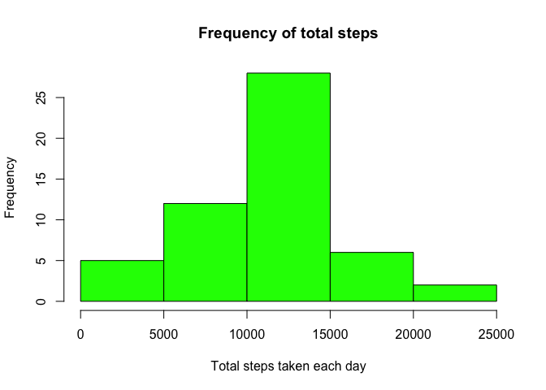
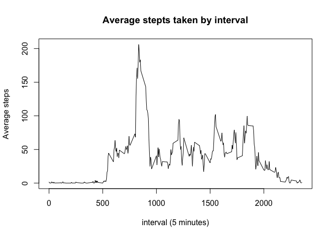
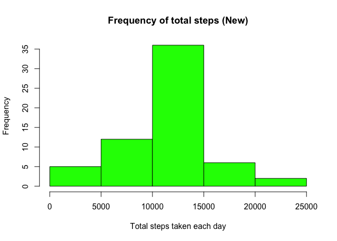
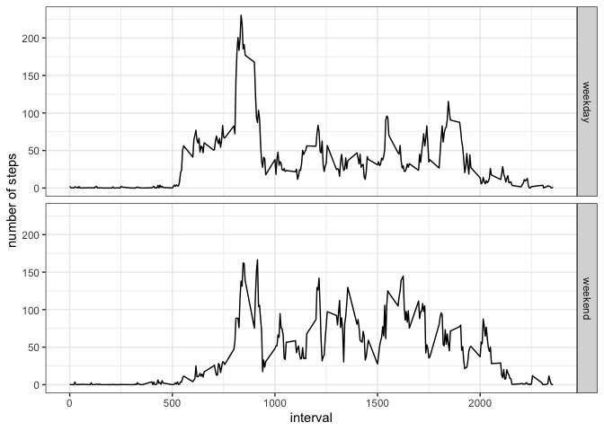

### 1. Downloading the packages needed


```r
library(downloader)
library(dplyr)
```

```
## 
## Attaching package: 'dplyr'
```

```
## The following objects are masked from 'package:stats':
## 
##     filter, lag
```

```
## The following objects are masked from 'package:base':
## 
##     intersect, setdiff, setequal, union
```

```r
library(readr)
library(tidyr)
library(ggplot2)
```


### 2. Loading and preprocessing the data

**Downloading the data and unzipping the folder**


```r
url <- "https://d396qusza40orc.cloudfront.net/repdata%2Fdata%2Factivity.zip"
download(url, "dataset.zip", mode = "wb")
unzip("dataset.zip", exdir = "./")
```


**Loading data into R and checking the first 6 columns**


```r
activity_data <- read.csv('activity.csv')
head(activity_data)
```

```
##   steps       date interval
## 1    NA 2012-10-01        0
## 2    NA 2012-10-01        5
## 3    NA 2012-10-01       10
## 4    NA 2012-10-01       15
## 5    NA 2012-10-01       20
## 6    NA 2012-10-01       25
```


**Using the summary function to check the data**


```r
summary(activity_data)
```

```
##      steps            date              interval     
##  Min.   :  0.00   Length:17568       Min.   :   0.0  
##  1st Qu.:  0.00   Class :character   1st Qu.: 588.8  
##  Median :  0.00   Mode  :character   Median :1177.5  
##  Mean   : 37.38                      Mean   :1177.5  
##  3rd Qu.: 12.00                      3rd Qu.:1766.2  
##  Max.   :806.00                      Max.   :2355.0  
##  NA's   :2304
```


### 3. What is mean total number of steps taken per day?

**First, let's change the date column to *date* type**


```r
activity_data$date <- as.Date(activity_data$date)
str(activity_data)
```

```
## 'data.frame':	17568 obs. of  3 variables:
##  $ steps   : int  NA NA NA NA NA NA NA NA NA NA ...
##  $ date    : Date, format: "2012-10-01" "2012-10-01" ...
##  $ interval: int  0 5 10 15 20 25 30 35 40 45 ...
```


**Creating a new variable *total_steps* to calculate the total number of steps taken per day and making a histogram of the results**


```r
total_steps <- activity_data%>%
    group_by(date)%>%
    summarise(total_steps = sum(steps))
```

```
## `summarise()` ungrouping output (override with `.groups` argument)
```

```r
hist(total_steps$total_steps, col = 'green', main = 'Frequency of total steps', xlab = 'Total steps taken each day')
```

<!-- -->


**Creating a new variable *steps_by_day* to calculate and report the mean and median of the total number of steps taken per day**


```r
total_steps_median <- median(total_steps$total_steps, na.rm = TRUE)
total_steps_mean <- mean(total_steps$total_steps, na.rm = TRUE)

print(total_steps_median)
```

```
## [1] 10765
```

```r
print(total_steps_mean)
```

```
## [1] 10766.19
```


**Shown from the summary statistics above, the mean and median of the total steps by day are approximately the same, slightly over 10,000 steps.** 

### 4. What is the average daily activity pattern?

**Creating a new variable *avg_steps* calculating the average steps by the 5 minute interval**


```r
avg_steps <- activity_data %>% group_by(interval) %>% summarise(average_steps_by_interval = mean(steps, na.rm = TRUE))
```

```
## `summarise()` ungrouping output (override with `.groups` argument)
```

```r
avg_steps
```

```
## # A tibble: 288 x 2
##    interval average_steps_by_interval
##       <int>                     <dbl>
##  1        0                    1.72  
##  2        5                    0.340 
##  3       10                    0.132 
##  4       15                    0.151 
##  5       20                    0.0755
##  6       25                    2.09  
##  7       30                    0.528 
##  8       35                    0.868 
##  9       40                    0     
## 10       45                    1.47  
## # … with 278 more rows
```


**Making a time series plot of the 5-minute intervaland the average number of steps taken, averaged across all days**


```r
with(avg_steps, plot(interval, average_steps_by_interval, type = 'l', main = 'Average stepts taken by interval', xlab = 'interval (5 minutes)', ylab = 'Average steps'))
```

<!-- -->


**Which 5-minute interval, on average across all the days in the dataset, contains the maximum number of steps?**


```r
subset(avg_steps, avg_steps$average_steps_by_interval==
           max(avg_steps$average_steps_by_interval))
```

```
## # A tibble: 1 x 2
##   interval average_steps_by_interval
##      <int>                     <dbl>
## 1      835                      206.
```


**As shown above, the maximum average_steps_by_interval occurs at the interval having the value as 835, just before 2 o'clock in the afternoon.** 


### 5. Imputing missing values

**Calculate and report the total number of missing values in the dataset.**


```r
nrow(filter(activity_data, is.na(activity_data$steps)))
```

```
## [1] 2304
```

```r
nrow(filter(activity_data, is.na(activity_data$date)))
```

```
## [1] 0
```

```r
nrow(filter(activity_data, is.na(activity_data$interval)))
```

```
## [1] 0
```


**As shown above, only the first column *steps* had *NA* values. As it is to be expected that the number of steps is affected by which time of the day these occur, let's replace NA values with the mean for that 5-minute interval.** 


```r
#changing the dataset to a list
activity_list <- as.list(as.data.frame(t(activity_data)))

#loop through the list and replace 'na's with mean steps at the same interval
for (i in 1: length(activity_list)) {if (is.na(activity_list[[c(i,1)]])) {
    replace_value <- as.numeric(avg_steps %>% 
                                    filter(interval == as.integer(
                                                    activity_list[[c(i,3)]])) %>%
                                    select(average_steps_by_interval))
    activity_list[[c(i,1)]] <- replace_value}
    }
```


**Creating a new dataset from the modified list. The new dataset is equal to the original dataset but with the missing data filled in.**


```r
activity_data_new <- as.data.frame(t(as.data.frame(activity_list)))
```


**Adding column names to the new data frame and change data type.**


```r
names(activity_data_new) <- c("steps", "date", "interval")
activity_data_new$steps <- as.numeric(activity_data_new$steps)
activity_data_new$date <- as.Date(activity_data_new$date)
activity_data_new$interval <- as.integer(activity_data_new$interval)
str(activity_data_new)
```

```
## 'data.frame':	17568 obs. of  3 variables:
##  $ steps   : num  1.717 0.3396 0.1321 0.1509 0.0755 ...
##  $ date    : Date, format: "2012-10-01" "2012-10-01" ...
##  $ interval: int  0 5 10 15 20 25 30 35 40 45 ...
```


**Making a histogram of the total number of steps taken each day from the new data**


```r
total_steps_new <- activity_data_new%>%
    group_by(date)%>%
    summarise(total_steps_new = sum(steps))
```

```
## `summarise()` ungrouping output (override with `.groups` argument)
```

```r
hist(total_steps_new$total_steps_new, col = 'green', main = 'Frequency of total steps (New)', xlab = 'Total steps taken each day')
```

<!-- -->


**Calculate and report the mean and median total number of steps taken per day.**


```r
total_steps_mean_new <- mean(total_steps_new$total_steps_new)
total_steps_median_new <- median(total_steps_new$total_steps_new)

print(total_steps_mean_new)
```

```
## [1] 10766.19
```

```r
print(total_steps_median_new)
```

```
## [1] 10766.19
```


**As far the mean and median values are concerned, ignoring the NA values and filling NA values with mean values of the steps at the same interval didn't make much change. This is a desirable effect because we do not want filling na values to change the shape of the data.** 


### 6. Are there differences in activity patterns between weekdays and weekends?


**Creating a new factor variable in the dataset with two levels – *weekday* and *weekend* indicating whether a given date is a weekday or weekend day.**


```r
library(chron)
activity_data_new <- activity_data_new %>% mutate (day_week =
                            ifelse(is.weekend(activity_data_new$date),
                                   'weekend', 'weekday'))
```


**Making a panel plot containing a time series plot of the 5-minute interval (x-axis) and the average number of steps taken, averaged across all weekday days or weekend days (y-axis).**


```r
avg_steps_new <- activity_data_new %>% group_by(day_week, interval) %>%
    summarise(average_steps = mean(steps))
```

```
## `summarise()` regrouping output by 'day_week' (override with `.groups` argument)
```

```r
avg_steps_new
```

```
## # A tibble: 576 x 3
## # Groups:   day_week [2]
##    day_week interval average_steps
##    <chr>       <int>         <dbl>
##  1 weekday         0        2.25  
##  2 weekday         5        0.445 
##  3 weekday        10        0.173 
##  4 weekday        15        0.198 
##  5 weekday        20        0.0990
##  6 weekday        25        1.59  
##  7 weekday        30        0.693 
##  8 weekday        35        1.14  
##  9 weekday        40        0     
## 10 weekday        45        1.80  
## # … with 566 more rows
```


```r
p <- ggplot(avg_steps_new, aes(interval, average_steps)) + geom_line()
p + facet_grid(rows = vars(day_week)) + 
    labs(x = "interval", y = "number of steps") + theme_bw()
```

<!-- -->


**As shown in the plots above, overall the activity pattern throughout the day follows a similar pattern during the weekdays and on the weekend, although the maximum average steps by interval during the weekdays is higher than that on the weekend by over 100 steps.**

